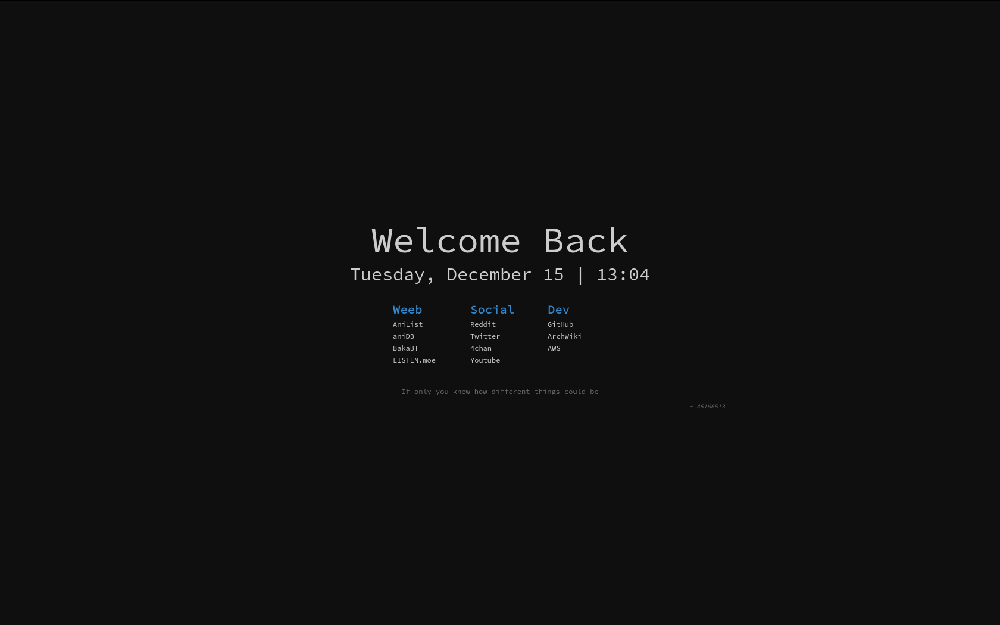

# kaishi

I prefer my startpages simplistic and comfortable without all the unnecessary wizbang.



## Config

### prefs.js

#### sites

The list of sites the page should suggest when typing a query.
Follows a `"name": "url"` standard.
For example: `"Reddit": "https://reddit.com"`

#### quotes

The list of quotes that are randomly displayed at the bottom of the page.

##### quote

The quote...

##### author

The author of the quote

##### Example

```
"quote": "But you can be better you silly duck",
"author": "7222918"
```

### index.css

The style of the website, edit this however you want

### index.html

The base layout of the website, change this to your liking.

## Other Info

Look at [this](https://luke-baker.github.io/) for how to set this as the new tab page.
Yes I know this code is absolute garbage, I can't be bothered working on it to make it more nicer looking, it just werks.
